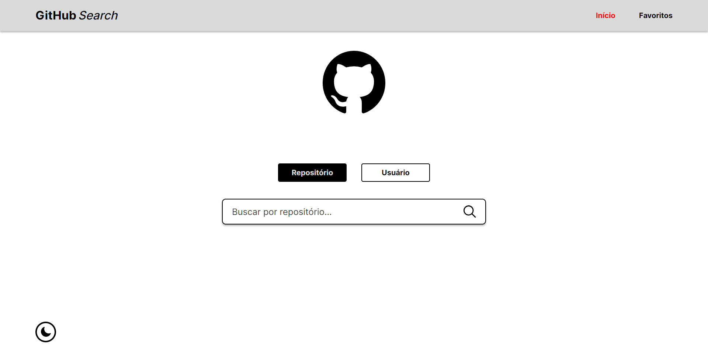

# **Vinícius Roveri - LuxOne** ([Ir para o Site](https://vinicius-roveri-luxone.vercel.app/))

 

Teste do processo seletivo da LuxOne no qual foi desenvolvido uma aplicação de pesquisa de repositórios e usuários utilizando a API do GitHub, seguindo as funcionalidades propostas e o layout do Figma apresentado.

 

### **Índice:**

- #### [Opção de pesquisa por repositório ou usuário](#opção-de-pesquisa-por-repositório-ou-usuário-1)

- #### [Repositórios salvos nos favoritos](#repositórios-salvos-nos-favoritos-1)
   - #### [Na página de favoritos](#na-página-de-favoritos-1)
   - #### [No card do repositório](#no-card-do-repositório-1)

- #### [Resultados de busca tanto de usuários quanto de repositórios](#resultados-de-busca-tanto-de-usuários-quanto-de-repositórios-1)
   - #### [Apresentação](#apresentação-1)
   - #### [Botão de Ver Mais](#botão-de-ver-mais-1)
   - #### [Botão de mudar de página](#botão-de-mudar-de-página-1)

- #### [Aviso de repositório ou usuário não encontrado](#aviso-de-repositório-ou-usuário-não-encontrado-1)

- #### [Pesquisa por favoritos](#pesquisa-por-favoritos-1)

- #### [Dark Mode](#dark-mode-1)

- #### [Considerações finais](#considerações-finais-1)

 

## Como eu solucionei os problemas deste projeto?

 

- ### **Opção de pesquisa por repositório ou usuário**

O seletor de filtro consiste em dois botões, cada um selecionando uma das opções. A ação de selecionar um filtro muda o estado global `selectedFilter`, e este estado é usado ao submeter a pesquisa para redirecionar o usuário para a página de resultados correspondente, onde o server-side automaticamente irá checar o caminho do redirecionamento para obter tanto o filtro quanto a pesquisa para entregar os resultados desejados.

 

- ### **Repositórios salvos nos favoritos**

Antes de encontrar a solução eu foquei em alguns problemas a resolver que eu poderia ter com essa funcionalidade: Como fazer os favoritos aparecerem de fato na página de favoritos, como não perdê-los ao recarregar ou fechar a página e como atualizar o ícone de estrela sempre que um repositório for favorito. A resposta mais consistente para todos estes problemas foi a mesma que eu já tinha usado em outro projeto com este mesmo esquema de favoritar itens: O `localStorage`, lá eu pude salvar os repositórios permanentemente quando eles fossem favoritados e em seguida fazer as lógicas necessárias na criação da lista de favoritos e do card do repositório.

   - ### Na página de favoritos

      Para criar a lista da página eu programei um serviço que automaticamente busca e faz o `parse` do item responsável pelos favoritos e já retorna prontamente o array com eles pra eu utilizar novamente o mesmo componente que cria as listas de resultados de pesquisas através do `.map`, que será explicado em breve.

   - ### No card do repositório

      Na criação de um card de repositório é chamado um outro serviço que por sua vez checa se o repositório de determinado card é favorito, assim mudando a cor da estrela do card de acordo. Esta solução possibilita que a estrela tenha a cor correta independente do contexto em que se encontre, seja na página de favoritos, nos resultados de pesquisa ou na página de informações do usuário.

 

- ### **Resultados de busca tanto de usuários quanto de repositórios**

A obtenção dos resultados, como dito no tópico anterior, é feita no server-side depois do ato de redirecionamento, a fim do usuário não esperar todo o proesso de `GET` acontecer para ver o conteúdo em sua tela. Após isso há 3 detalhes a se comentar: a apresentação destes resultados para o usuário, o botão de Ver Mais resultados, e o botão de mudar a página de resultados

   - ### Apresentação

      A apresentação destes resultados é feita da mesma forma independentemente do filtro usado (repositórios ou usuários), e consiste em usar o método `.map` no array de resultados da busca para exibir todos cards na tela, variando apenas quais cards exibir, agora sim, segundo o filtro selecionado.

   - ### Botão de Ver Mais

      Para os casos onde este fosse utilizado, eu optei por um estado que diz a quantidade de itens a serem mostrados, somado a um estado que contém um array com os items a serem mostrados. Para fazer tudo funcionar basta fazer com que o estado dos resultados mostrados seja o retorno do método `.splice` aplicado no array original de resultados usando o estado da quantidade como limitador. Ao clicar no botão é adicionado um valor no estado da quantidade para fazer com que o ciclo recomece e o estado de resultados agora tenha mais itens.

   - ### Botão de mudar de página

      Este foi utilizado onde havia uma conexão direta com os dados da API. Como esta é dividida por páginas a funcionalidade consiste em ao clicar neles o usuário ser redirecionado para a mesma página de resultados que estava porém com o parametro `page` na URL atualizado de acordo, assim, como explicado anteriormente, o server-side automaticamente captura este valor da URL e faz a requisição pra a página desejada da API. Para eu criar estes botões bastou pegar o valor de `total_count` dos resultados e dividir por 30 (o número de resultados da API por página), com isso eu tinha o total de páginas e a partir daí bastou criar as funcionalidade de redirecionamento em cada botão. O botão também só aparece quando não há mais o botão "Ver Mais" disponível, pra isso bastou além de eu reutilizar a lógica de mostrar ou não o botão de "Ver Mais", checar se existem mais páginas de resultados e fazer o botão aparecer nesta condição.

 

- ### **Aviso de repositório ou usuário não encontrado**

Apesar da funcionalidade ser bem simples, a principal complicação foi devido a lógica de busca de resultados estar concentrada no server-side, portanto o controle sobre o display ou não desse aviso também teria que estar disponível por lá. A solução que eu escolhi foi: caso não houverem resultados para a busca, redirecionar o usuário para a Home e adicionar o parâmetro `err` na URL contendo o erro. A partir disso caso seja identificado que este parâmetro `err` exista, o Popup de aviso irá aparecer e ter sua mensagem personalizada baseada no valor deste parâmetro (mensagem esta podendo ser ou para repositório ou para usuário não encontrados).

 

- ### **Pesquisa por favoritos**

Para adicionar a pesquisa por nome na página de favoritos bastou incluir um `input` cujo `onChange` executasse 3 passos: Criasse uma `RegExp` com o valor do `input` da pesquisa, filtrasse o array de favoritos utilizando o método `.test` para checar quais nomes de repositório contém tal pesquisa e por fim fizesse com que este novo array filtrado fosse usado para fazer o `.map` e criar a lista de repositórios.

 

- ### **Dark Mode**

Pra essa funcionalidade eu contei com o suporte nativo do Tailwind CSS, com o qual apenas adicionando ou removendo a classe `dark` do documento HTML é possível ativar ou desativar o Dark Mode. Para fazer isso funcionar foi usado um estado global booleano que indica se o Dark Mode está ativo ou não, um botão responsável por alternar o modo e por fim um item no `localStorage` para armazenar esse valor e persistir a escolha do usuário mesmo após atualizar ou fechar a página.

 

## Considerações finais:

## **Quero ressaltar que mesmo utilizando o Next.js e Tailwind por serem as ferramentas que tenho maior afinidade, sou totalmente aberto a utilizar o Vue e SCSS no ambiente de trabalho sempre! Fiz questão de que este projeto provasse minhas habilidades e conceitos o suficiente para mostrar que eu sei exercer o que me é proposto independente do framework específico.**